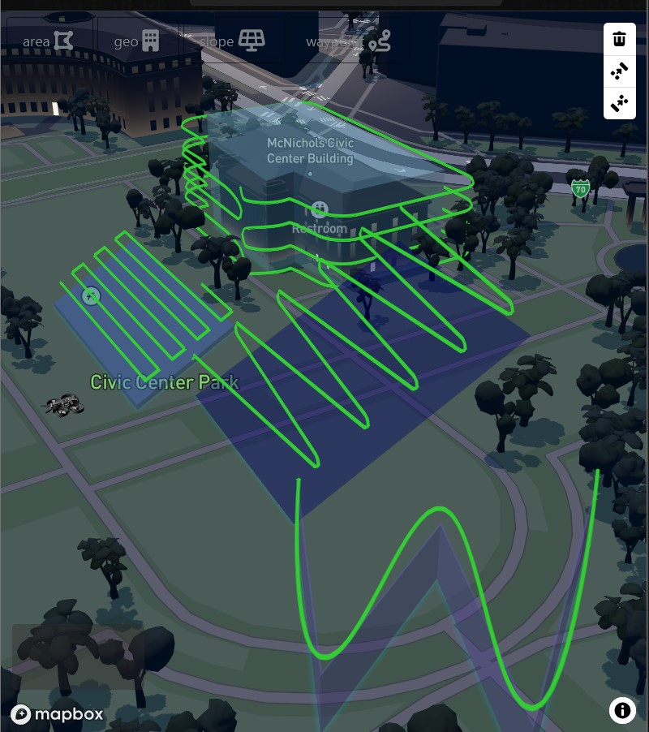
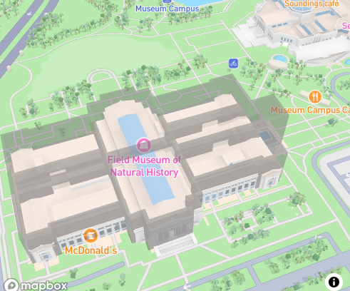

# Area Route | Mapbox-REACT


|--| Desc | Link |
|--| ----------- | ----------- |
|![ gh ][ 1 ]|Code  | https://github.com/attila5287/drone-route-area |
|![ vercel ][ 2 ]|Vercel-App live demo| https://drone-route-area.vercel.app/ |
|![ js ][ 3 ]|Pure-JS version  | https://attila5287.github.io/flight-route-3d/ |

[ 1 ]:https://raw.githubusercontent.com/attila5287/img_readme/refs/heads/main/all/ghub.png
[ 2 ]: https://raw.githubusercontent.com/attila5287/img_readme/refs/heads/main/png64px/9035134_logo_vercel_icon.png
[ 3 ]: https://raw.githubusercontent.com/attila5287/img_readme/refs/heads/main/all/js.png


## Brief Requirements
> User will draw a line
> Renders *Blue*  Extrusion Layer with def vals
> Renders *Green* Line Layer with def vals
> User input changes, renders related laayer

|Example|Ref|--|
|--|--|--|
|Draw polygon   | (base)    |https://docs.mapbox.com/mapbox-gl-js/example/mapbox-gl-draw/|
|Extrude Polygon| (building)|https://docs.mapbox.com/mapbox-gl-js/example/3d-extrusion-floorplan/|
|Elevated Line  | (route)   |https://docs.mapbox.com/mapbox-gl-js/example/elevated-line/|

### REACT live version on vercel

### Original Pure-JS Code

### Mapbox example as a starting point

### Mapbox example to extrude blue solid body

### Mapbox example to create 3-d line path


# About Developer

|![ gh2 ] |repo | portfolio |
|--|--|--|
|![ at ] | https://github.com/attila5287/|https://attila5287.github.io/ ||


[ gh2 ]: https://raw.githubusercontent.com/attila5287/img_readme/refs/heads/main/all/gh.png
[ at ]: https://raw.githubusercontent.com/attila5287/img_readme/refs/heads/main/all/dev.jpg


```JS
map.addSource('source_id', {
    type: 'geojson',
    data: {
        type: 'FeatureCollection',
        features: [  ]
    }
});
const geojsonSource = map.getSource('source_id');
// Update the data after the GeoJSON source was created
geojsonSource.setData({
    "type": "FeatureCollection",
    "features": [ {
        "type": "Feature",
        "properties": {"name": "Null Island"},
        "geometry": {
            "type": "Point",
            "coordinates": [  0, 0  ]
        }
    } ]
});
```

# GeoJson

> https://www.geoapify.com/geojson-javascript-developer-guide/


|Type	|	Coordinates	|Example | Structure	|
|--|--|--|--	|
|Point	 | Feature.Point | number[  ]	|` [ lon_A, lat_A ]` |
|MultiPoint	| Feature.MultiPoint |number[  ][  ]	|` 	[ [ lon_A, lat_A ], [ lon_B, lat_B ] ] `|
|LineString	 | Feature.LineString | number[  ][  ]	|` 	[ [ lon_A, lat_A ], [ lon_B, lat_B ], [ lon_C, lat_C ] ]` |
|MultiLineString | Feature.MultiLineString | number[  ][  ][  ]	|` 	[ [ [ lon_A, lat_A ], [ lon_B, lat_B ], [ lon_C, lat_C ] ], [ [ lon_D, lat_D ], [ lon_E, lat_E ] ] ]` |
|Polygon	 | Feature.Polygon | number[  ][  ][  ]		| `[ [ [ lon_A, lat_A ], [ lon_B, lat_B ], [ lon_C, lat_C ], [ lon_D, lat_D ], [ lon_E, lat_E ], [ lon_A, lat_A ] ],[ [ lon_F, lat_F ], [ lon_G, lat_G ], [ lon_H, lat_H ], [ lon_F, lat_F ] ] ]` |
| MultiPolygon	 |  Feature.MultiPolygon | number[  ][  ][  ][  ]		| `[ [ [ [ lon_A, lat_A ], [ lon_B, lat_B ], [ lon_C, lat_C ], [ lon_D, lat_D ], [ lon_E, lat_E ], [ lon_A, lat_A ] ],[ [ lon_F, lat_F ], [ lon_G, lat_G ], [ lon_H, lat_H ], [ lon_F, lat_F ] ] ], [ [ [ lon_I, lat_I ], [ lon_J, lat_J ], [ lon_K, lat_K ], [ lon_I, lat_I ] ] ] ]` |